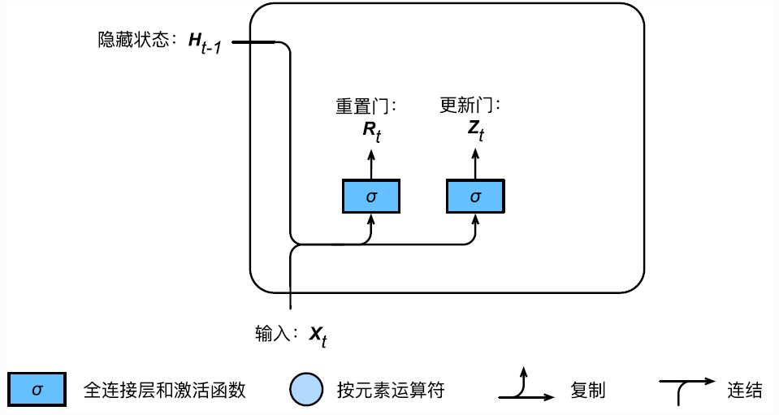
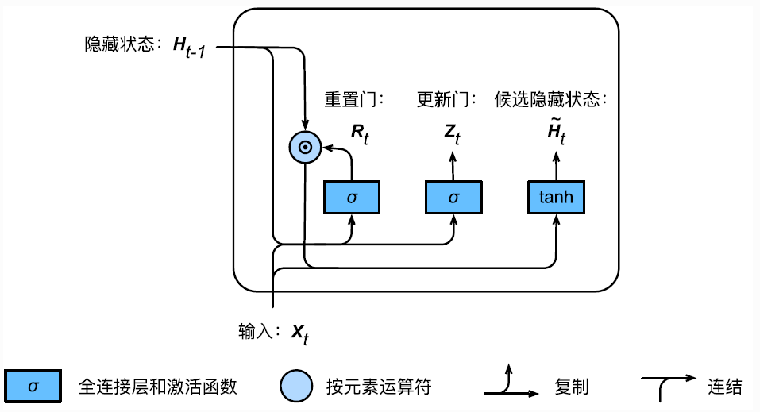
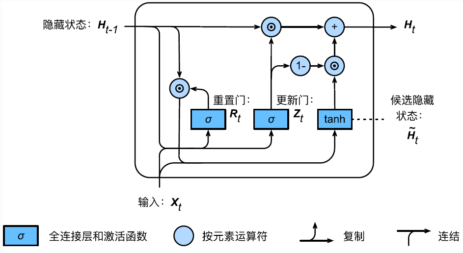
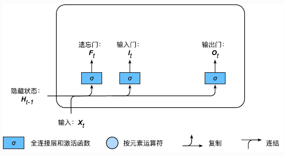
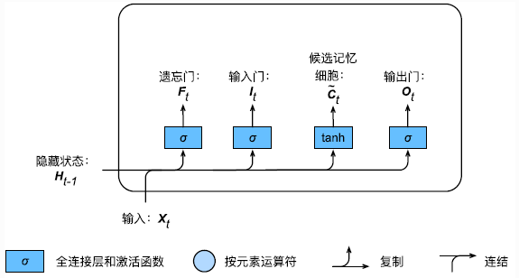
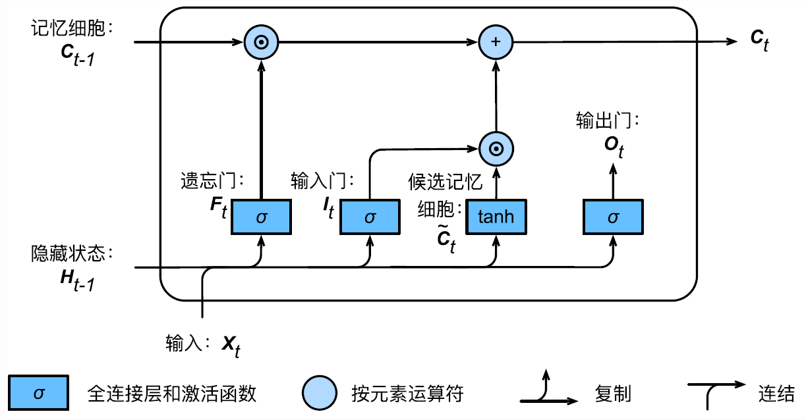
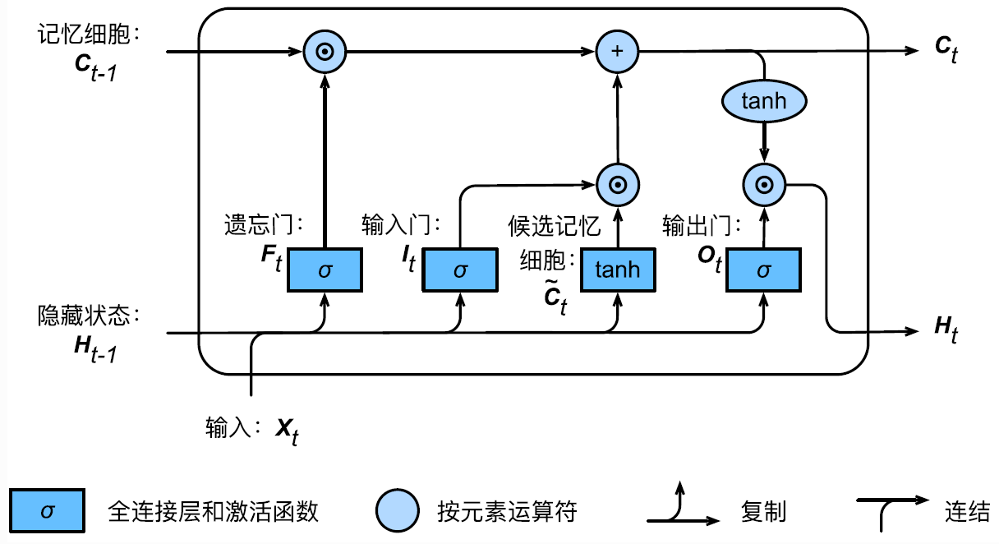
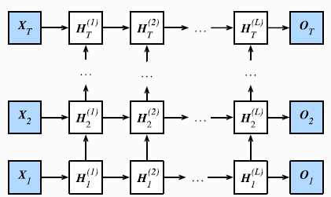
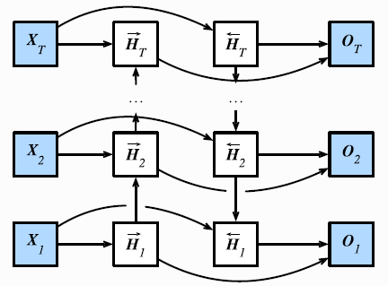

# 从0开始学PyTorch（三）：机器学习和深度学习面临的经典问题、神经网络进阶

[toc]

本次学习分为三部分分别是：

（1）机器学习中面临的过拟合、欠拟合问题及其解决方案；

（2）深度学习中梯度消失和梯度爆炸问题；

（3）循环神经网络进阶

## 一、过拟合和欠拟合

- 训练误差（training error）：指模型在训练数据集上表现出的误差

- 泛化误差（generalization error）：指模型在任意一个测试数据样本上表现出的误差的期望，并常常通过测试数据集上的误差来近似。

计算训练误差和泛化误差可以使用之前介绍过的损失函数，例如线性回归用到的平方损失函数和softmax回归用到的交叉熵损失函数。

机器学习模型应关注降低泛化误差。

### 1.模型选择

#### 验证数据集

从严格意义上讲，测试集只能在所有超参数和模型参数选定后使用一次。不可以使用测试数据选择模型，如调参。由于无法从训练误差估计泛化误差，因此也不应只依赖训练数据选择模型。鉴于此，我们可以预留一部分在训练数据集和测试数据集以外的数据来进行模型选择。这部分数据被称为验证数据集，简称验证集（validation set）。例如，我们可以从给定的训练集中随机选取一小部分作为验证集，而将剩余部分作为真正的训练集。

#### K折交叉验证

由于验证数据集不参与模型训练，当训练数据不够用时，预留大量的验证数据显得太奢侈。一种改善的方法是K折交叉验证（K-fold cross-validation）。**在K折交叉验证中，我们把原始训练数据集分割成K个不重合的子数据集，然后我们做K次模型训练和验证。每一次，我们使用一个子数据集验证模型，并使用其他K-1个子数据集来训练模型。在这K次训练和验证中，每次用来验证模型的子数据集都不同。最后，我们对这K次训练误差和验证误差分别求平均。**

### 2.过拟合和欠拟合

接下来，将探究模型训练中经常出现的两类典型问题：

- 一类是模型无法得到较低的训练误差，将这一现象称作**欠拟合**（underfitting）；
- 另一类是模型的训练误差远小于它在测试数据集上的误差，称该现象为**过拟合（overfitting）**。 在实践中，要尽可能同时应对欠拟合和过拟合。虽然有很多因素可能导致这两种拟合问题，在这里重点讨论两个因素：模型复杂度和训练数据集大小。

#### 模型复杂度

为了解释模型复杂度，以多项式函数拟合为例。给定一个由标量数据特征$x$和对应的标量标签$y$组成的训练数据集，多项式函数拟合的目标是找一个$K$阶多项式函数


$$
\hat{y} = b + \sum_{k=1}^K x^k w_k
$$


来近似 $y$。在上式中，$w_k$是模型的权重参数，$b$是偏差参数。与线性回归相同，多项式函数拟合也使用平方损失函数。特别地，一阶多项式函数拟合又叫线性函数拟合。

给定训练数据集，模型复杂度和误差之间的关系：


#### 训练数据集大小

影响欠拟合和过拟合的另一个重要因素是**训练数据集的大小**。一般来说，

- 如果训练数据集中样本数过少，特别是比模型参数数量（按元素计）更少时，过拟合更容易发生。

- 泛化误差不会随训练数据集里样本数量增加而增大。

因此，在计算资源允许的范围之内，通常希望训练数据集大一些，特别是在模型复杂度较高时，例如层数较多的深度学习模型。

### 权重衰减
#### 方法  
权重衰减等价于 $L_2$ 范数正则化（regularization）。正则化通过为模型损失函数添加惩罚项使学出的模型参数值较小，是应对过拟合的常用手段。

####  L2 范数正则化（regularization）
$L_2$范数正则化在模型原损失函数基础上添加$L_2$范数惩罚项，从而得到训练所需要最小化的函数。$L_2$范数惩罚项指的是模型权重参数每个元素的平方和与一个正的常数的乘积。以线性回归中的线性回归损失函数为例


$$
 \ell(w_1, w_2, b) = \frac{1}{n} \sum_{i=1}^n \frac{1}{2}\left(x_1^{(i)} w_1 + x_2^{(i)} w_2 + b - y^{(i)}\right)^2 
$$


其中$w_1, w_2$是权重参数，$b$是偏差参数，样本$i$的输入为$x_1^{(i)}, x_2^{(i)}$，标签为$y^{(i)}$，样本数为$n$。将权重参数用向量$\boldsymbol{w} = [w_1, w_2]$表示，带有$L_2$范数惩罚项的新损失函数为


$$
\ell(w_1, w_2, b) + \frac{\lambda}{2n} |\boldsymbol{w}|^2,
$$


其中超参数$\lambda > 0$。当权重参数均为0时，惩罚项最小。当$\lambda$较大时，惩罚项在损失函数中的比重较大，这通常会使学到的权重参数的元素较接近0。当$\lambda$设为0时，惩罚项完全不起作用。上式中$L_2$范数平方$|\boldsymbol{w}|^2$展开后得到$w_1^2 + w_2^2$。
有了$L_2$范数惩罚项后，在小批量随机梯度下降中，我们将线性回归一节中权重$w_1$和$w_2$的迭代方式更改为


$$
 \begin{aligned} w_1 &\leftarrow \left(1- \frac{\eta\lambda}{|\mathcal{B}|} \right)w_1 - \frac{\eta}{|\mathcal{B}|} \sum_{i \in \mathcal{B}}x_1^{(i)} \left(x_1^{(i)} w_1 + x_2^{(i)} w_2 + b - y^{(i)}\right),\\ w_2 &\leftarrow \left(1- \frac{\eta\lambda}{|\mathcal{B}|} \right)w_2 - \frac{\eta}{|\mathcal{B}|} \sum_{i \in \mathcal{B}}x_2^{(i)} \left(x_1^{(i)} w_1 + x_2^{(i)} w_2 + b - y^{(i)}\right). \end{aligned} 
$$

可见，$L_2$范数正则化令权重$w_1$和$w_2$先自乘小于1的数，再减去不含惩罚项的梯度。因此，$L_2$范数正则化又叫权重衰减。权重衰减通过惩罚绝对值较大的模型参数为需要学习的模型增加了限制，这可能对过拟合有效。

#### 丢弃法

多层感知机中神经网络图描述了一个单隐藏层的多层感知机。其中输入个数为4，隐藏单元个数为5，且隐藏单元$h_i$（$i=1, \ldots, 5$）的计算表达式为


$$
 h_i = \phi\left(x_1 w_{1i} + x_2 w_{2i} + x_3 w_{3i} + x_4 w_{4i} + b_i\right) 
$$


这里$\phi$是激活函数，$x_1, \ldots, x_4$是输入，隐藏单元$i$的权重参数为$w_{1i}, \ldots, w_{4i}$，偏差参数为$b_i$。当对该隐藏层使用丢弃法时，该层的隐藏单元将有一定概率被丢弃掉。设丢弃概率为$p$，那么有$p$的概率$h_i$会被清零，有$1-p$的概率$h_i$会除以$1-p$做拉伸。丢弃概率是丢弃法的超参数。具体来说，设随机变量$\xi_i$为0和1的概率分别为$p$和$1-p$。使用丢弃法时我们计算新的隐藏单元$h_i'$


$$
 h_i' = \frac{\xi_i}{1-p} h_i 
$$


由于$E(\xi_i) = 1-p$，因此


$$
 E(h_i') = \frac{E(\xi_i)}{1-p}h_i = h_i 
$$


即丢弃法不改变其输入的期望值。让我们对之前多层感知机的神经网络中的隐藏层使用丢弃法，一种可能的结果如图所示，其中$h_2$和$h_5$被清零。这时输出值的计算不再依赖$h_2$和$h_5$，在反向传播时，与这两个隐藏单元相关的权重的梯度均为0。由于在训练中隐藏层神经元的丢弃是随机的，即$h_1, \ldots, h_5$都有可能被清零，输出层的计算无法过度依赖$h_1, \ldots, h_5$中的任一个，从而在训练模型时起到正则化的作用，并可以用来应对过拟合。在测试模型时，我们为了拿到更加确定性的结果，一般不使用丢弃法


PyTorch的简洁实现：

```python
%matplotlib inline
import torch
import torch.nn as nn
import numpy as np
import sys
sys.path.append("/home/kesci/input")
import d2lzh1981 as d2l

print(torch.__version__)

net = nn.Sequential(
        d2l.FlattenLayer(),
        nn.Linear(num_inputs, num_hiddens1),
        nn.ReLU(),
        nn.Dropout(drop_prob1),
        nn.Linear(num_hiddens1, num_hiddens2), 
        nn.ReLU(),
        nn.Dropout(drop_prob2),
        nn.Linear(num_hiddens2, 10)
        )

for param in net.parameters():
    nn.init.normal_(param, mean=0, std=0.01)

optimizer = torch.optim.SGD(net.parameters(), lr=0.5)
d2l.train_ch3(net, train_iter, test_iter, loss, num_epochs, batch_size, None, None, optimizer)
```


## 二、深度学习中的梯度消失和梯度爆炸问题

深度模型有关数值稳定性的典型问题是消失（vanishing）和爆炸（explosion）。

**当神经网络的层数较多时，模型的数值稳定性容易变差。**

假设一个层数为$L$的多层感知机的第$l$层$\boldsymbol{H}^{(l)}$的权重参数为$\boldsymbol{W}^{(l)}$，输出层$\boldsymbol{H}^{(L)}$的权重参数为$\boldsymbol{W}^{(L)}$。为了便于讨论，不考虑偏差参数，且设所有隐藏层的激活函数为恒等映射（identity mapping）$\phi(x) = x$。给定输入$\boldsymbol{X}$，多层感知机的第$l$层的输出$\boldsymbol{H}^{(l)} = \boldsymbol{X} \boldsymbol{W}^{(1)} \boldsymbol{W}^{(2)} \ldots \boldsymbol{W}^{(l)}$。此时，如果层数$l$较大，$\boldsymbol{H}^{(l)}$的计算可能会出现衰减或爆炸。举个例子，假设输入和所有层的权重参数都是标量，如权重参数为0.2和5，多层感知机的第30层输出为输入$\boldsymbol{X}$分别与$0.2^{30} \approx 1 \times 10^{-21}$（消失）和$5^{30} \approx 9 \times 10^{20}$（爆炸）的乘积。当层数较多时，梯度的计算也容易出现消失或爆炸。

### 随机初始化模型参数

在神经网络中，通常需要随机初始化模型参数。下面我们来解释这样做的原因。

回顾多层感知机一节描述的多层感知机。为了方便解释，假设输出层只保留一个输出单元$o_1$（删去$o_2$和$o_3$以及指向它们的箭头），且隐藏层使用相同的激活函数。如果将每个隐藏单元的参数都初始化为相等的值，那么在正向传播时每个隐藏单元将根据相同的输入计算出相同的值，并传递至输出层。在反向传播中，每个隐藏单元的参数梯度值相等。因此，这些参数在使用基于梯度的优化算法迭代后值依然相等。之后的迭代也是如此。在这种情况下，无论隐藏单元有多少，隐藏层本质上只有1个隐藏单元在发挥作用。因此，正如在前面的实验中所做的那样，我们通常将神经网络的模型参数，特别是权重参数，进行随机初始化。


####  PyTorch的默认随机初始化

随机初始化模型参数的方法有很多。在线性回归的简洁实现中，我们使用`torch.nn.init.normal_()`使模型`net`的权重参数采用正态分布的随机初始化方式。不过，PyTorch中`nn.Module`的模块参数都采取了较为合理的初始化策略（不同类型的layer具体采样的哪一种初始化方法的可参考[源代码](https://github.com/pytorch/pytorch/tree/master/torch/nn/modules)），因此一般不用我们考虑。


#### Xavier随机初始化

还有一种比较常用的随机初始化方法叫作Xavier随机初始化。
假设某全连接层的输入个数为$a$，输出个数为$b$，Xavier随机初始化将使该层中权重参数的每个元素都随机采样于均匀分布


$$
U\left(-\sqrt{\frac{6}{a+b}}, \sqrt{\frac{6}{a+b}}\right).
$$


它的设计主要考虑到，模型参数初始化后，每层输出的方差不该受该层输入个数影响，且每层梯度的方差也不该受该层输出个数影响。

### 考虑环境因素

#### 协变量偏移

这里我们假设，虽然输入的分布可能随时间而改变，但是标记函数，即条件分布P（y∣x）不会改变。虽然这个问题容易理解，但在实践中也容易忽视。

想想区分猫和狗的一个例子。我们的训练数据使用的是猫和狗的真实的照片，但是在测试时，我们被要求对猫和狗的卡通图片进行分类。

|cat|cat|dog|dog|
|:---------------:|:---------------:|:---------------:|:---------------:|
|||||

测试数据：

|cat|cat|dog|dog|
|:---------------:|:---------------:|:---------------:|:---------------:|
|||||

显然，这不太可能奏效。训练集由照片组成，而测试集只包含卡通。在一个看起来与测试集有着本质不同的数据集上进行训练，而不考虑如何适应新的情况，这是不是一个好主意。不幸的是，这是一个非常常见的陷阱。

统计学家称这种协变量变化是因为问题的根源在于特征分布的变化（即协变量的变化）。数学上，我们可以说P（x）改变了，但P（y∣x）保持不变。尽管它的有用性并不局限于此，当我们认为x导致y时，协变量移位通常是正确的假设。


#### 标签偏移


当我们认为导致偏移的是标签P（y）上的边缘分布的变化，但类条件分布是不变的P（x∣y）时，就会出现相反的问题。当我们认为y导致x时，标签偏移是一个合理的假设。例如，通常我们希望根据其表现来预测诊断结果。在这种情况下，我们认为诊断引起的表现，即疾病引起的症状。有时标签偏移和协变量移位假设可以同时成立。例如，当真正的标签函数是确定的和不变的，那么协变量偏移将始终保持，包括如果标签偏移也保持。有趣的是，当我们期望标签偏移和协变量偏移保持时，使用来自标签偏移假设的方法通常是有利的。这是因为这些方法倾向于操作看起来像标签的对象，这（在深度学习中）与处理看起来像输入的对象（在深度学习中）相比相对容易一些。

病因（要预测的诊断结果）导致 症状（观察到的结果）。  

训练数据集，数据很少只包含流感p(y)的样本。  

而测试数据集有流感p(y)和流感q(y)，其中不变的是流感症状p(x|y)。


#### 概念偏移

另一个相关的问题出现在概念转换中，即标签本身的定义发生变化的情况。这听起来很奇怪，毕竟猫就是猫。的确，猫的定义可能不会改变，但我们能不能对软饮料也这么说呢？事实证明，如果我们周游美国，按地理位置转移数据来源，我们会发现，即使是如图所示的这个简单术语的定义也会发生相当大的概念转变。


$$
美国软饮料名称的概念转变 
$$
如果我们要建立一个机器翻译系统，分布P（y∣x）可能因我们的位置而异。这个问题很难发现。另一个可取之处是P（y∣x）通常只是逐渐变化。


## 三、循环神经网络进阶

前面的学习中介绍了循环神经网络中的梯度计算方法。但可以发现，当时间步数较大或者时间步较小时，循环神经网络的梯度较容易出现衰减或爆炸。**虽然裁剪梯度可以应对梯度爆炸，但无法解决梯度衰减的问题**。通常由于这个原因，循环神经网络在实际中较难捕捉时间序列中时间步距离较大的依赖关系。

而门控循环神经网络和LSTM等正是为了解决这个问题而提出的。

### 1.门控循环神经网络（GRU）

门控循环神经网络(gated recurrent neural network)的提出，正是为了更好地捕捉时间序列中时间步距离较大的依赖关系。它可以通过学习的门来控制信息的流动。

门控循环单元的设计引入了重置门(reset gate)和更新门(update gate)的概念，从而修改了循环神经网络中隐藏状态的计算方式。

#### 重置门

如图所示，门控循环单元中的重置门和更新门的输入均为当前时间步输入$X_t$与上一时间步隐藏状态$H_{t-1}$，输出由激活函数为sigmoid函数的全连接层计算得到。



具体来说，假设隐藏单元个数为$h$，给定时间步$t$的小批量输入$X_t \in R^{n \times d}$（样本数为$n$，输入个数为$d$）和上一时间步隐藏状态$H_{t-1} \in R^{n \times h}$。重置门$R_t \in R^{n \times h}$和更新门$Z_t \in R^{n \times h}$的计算如下：
$$
R_t = \sigma(X_{t}W_{xr} + H_{t-1}W_{hr} + b_r), \\
Z_t = \sigma(X_{t}W_{xz} + H_{t-1}W_{hz} + b_z)
$$
其中$W_{xr},W_{xz} \in R^{d \times h}$和$W_{hr},W_{hz} \in R^{h \times h}$是权重参数，$b_r,b_z \in R^{1 \times h}$是偏差参数。sigmoid函数可以将元素的值变换到0和1之间。因此，重置门$R_t$和更新门$Z_t$中每个元素的值域都是[0,1]。

#### 候选隐藏状态

计算候选隐藏状态主要是辅助稍后的隐藏状态计算。如下图所示，将当前时间步重置门的输出与上一时间步隐藏状态做按元素乘法（符号为$\odot$）。如果重置门中元素值接近0，那么意味着重置对应隐藏状态元素为0，即丢弃上一时间步的隐藏状态。如果元素值接近1，那么表示保留上一时间步的隐藏状态。然后，将按元素乘法的结果与当前时间步的输入连接，再通过含激活函数$tanh$的全连接层计算出候选隐藏状态，其所有元素的值域为[-1, 1]。



具体来说，时间步$t$的候选隐藏状态$\tilde{H}_t \in R^{n \times h}$的计算为
$$
\tilde{H}_t = tanh(X_tW_{xh} + (R_t \odot H_{t-1})W_{hh} + b_h)
$$
其中$W_{xh} \in R^{d \times h}$和$W_{hh} \in R^{h \times h}$是权重参数，$b_h \in R^{1 \times h}$是偏差参数。从上面这个公式可以看出，重置门控制了上一时间步的隐藏状态如何流入当前时间步的候选隐藏状态。而上一时间步的隐藏状态可能包含了时间序列截止至上一时间步的全部历史信息。因此，重置门可以用来丢弃与预测无关的历史信息。

#### 隐藏状态

最后，时间步$t$的隐藏状态$H_t \in R^{n \times h}$的计算使用当前时间步的更新门$Z_t$来对上一时间步的隐藏状态$H_{t-1}$和当前时间步的候选隐藏状态$\tilde{H}_{t}$做组合：
$$
H_t = Z_t \odot H_{t-1} + (1-Z_t) \odot \tilde{H}_t
$$


值得注意的是，更新门可以控制隐藏状态应该如何被包含当前时间步信息的候选隐藏状态所更新，如上图所示。假设更新门在时间步$t'$到$t(t' \lt t)$之间一直近似1。那么，在时间步$t'$到$t$之间的输入信息几乎没有流入时间步$t$的隐藏状态$H_t$。实际上，这可以看作是较早时刻的隐藏状态$H_{t'-1}$一直通过时间保存并传递至当前时间步$t$。这个设计可以应对神经网络中的梯度衰减问题，并更好地捕捉时间序列中时间步距离较大的依赖。

总之，

- 重置门有助于捕捉时间序列里短期的依赖关系；
- 更新门有助于捕捉时间序列里长期的依赖关系。

### 2.长短期记忆（LSTM）

长短期记忆(long short-term memory, LSTM)是一种常用的门控循环神经网络，它比门控循环单元的结构稍微复杂一点。

LSTM中引入了3个门，即输入门(Input Gate)、遗忘门(Forget Gate)和输出门(Output Gate)，以及与隐藏状态形状相同的记忆细胞（某些文献里把记忆细胞当成一种特殊的隐藏状态），从而记录额外的信息。

#### 输入门、遗忘门和输出门

与门控循环单元中的重置门和更新门一样，如下图所示，长短期记忆的门输入均为当前时间步输入$X_t$与上一时间步隐藏状态$H_{t-1}$，输出由激活函数为sigmoid函数的全连接层计算得到。如此一来，这3个门元素的值域均为[0,1]。



具体来说，假设隐藏单元个数为h，给定时间步$t$的小批量输入$X_t \in R^{n \times d}$（样本数为$n$，输入个数为$d$）和上一时间步隐藏状态$H_{t-1} \in R^{n \times h}$。时间步$t$的输入门$I_t \in R^{n \times h}$、遗忘门$F_t \in R^{n \times h}$和输出门$O_t \in R^{n \times h}$分别计算如下：
$$
I_t = \sigma(X_tW_{xi} + H_{t-1}W_{hi} + b_i), \\
F_t = \sigma(X_tW_{xf} + H_{t-1}W_{hf} + b_f), \\
O_t = \sigma(X_tW_{xo} + H_{t-1}W_{ho} + b_o)
$$
其中的$W_{xi},W_{xf},W_{xo} \in R^{d \times h}$和$W_{hi},W_{hf},W_{ho} \in R^{h \times h}$是权重参数，$b_i,b_f,b_o \in R^{1 \times h}$是偏差参数。

#### 候选记忆细胞

接下来，长短期记忆需要计算候选记忆细胞$\tilde{C}_t$。它的计算与上面介绍的3个门类似，但使用了值域在[-1,1]的`tanh`函数作为激活函数，如下图所示：



具体来说，时间步$t$的候选记忆细胞$\tilde{C}_t \in R^{n \times h}$的计算为
$$
\tilde{C}_t = tanh(X_tW_{xc} + H_{t-1}W_{hc} + b_c)
$$
其中$W_{xc} \in R^{d \times h}$和$W_{hc} \in R^{h \times h}$是权重参数，$b_c \in R^{1 \times h}$是偏差参数。

#### 记忆细胞

可以通过元素值域在[0,1]的输入门、遗忘门和输出门来控制隐藏状态中信息的流动，这一般也是通过使用按元素乘法（符号为$\odot$）来实现的。当前时间步记忆细胞$C_t \in R^{n \times h}$的计算组合了上一时间步记忆细胞和当前时间步候选记忆细胞的信息，并通过遗忘门和输入门来控制信息的流动：
$$
C_t = F_t \odot C_{t-1} + I_t \odot \tilde{C}_t
$$
如下图所示，遗忘门控制上一时间步的记忆细胞$C_{t-1}$中的信息是否传递到当前时间步，而输入门则控制当前时间步的输入$X_t$通过候选记忆细胞$\tilde{C}_t$如何流入当前时间步的记忆细胞。如果遗忘门一直近似1且输入门一直近似0，过去的记忆细胞将一直通过时间保存并传递至当前时间步。这个设计可以应对循环神经网络中的梯度衰减问题，并更好地捕捉时间序列中的时间步距离较大的依赖关系。



#### 隐藏状态

有了记忆细胞后，接下来还可以通过输出门来控制从记忆细胞到隐藏状态$H_t \in R^{n \times h}$的信息的流动：
$$
H_t = O_t \odot tanh(C_t)
$$
这里的`tanh`函数确保隐藏状态元素值在-1到1之间。需要注意的是，当输出门近似1时，记忆细胞信息将传递到隐藏状态供输出层使用；当输出门近似0时，记忆细胞信息只自己保留。下图展示了长短期记忆中隐藏状态的计算。



**简洁实现**：

```python
import numpy as np
import torch
from torch import nn, optim
import torch.nn.functional as F
import sys
sys.path.append("..")
import d2lzh_pytorch as d2l

lr = 1e-2 # 注意调整学习率
lstm_layer = nn.LSTM(input_size=vocab_size, hidden_size=num_hiddens)
model = d2l.RNNModel(lstm_layer, vocab_size)
d2l.train_and_predict_rnn_pytorch(model, num_hiddens, vocab_size, device, corpus_indices, idx_to_char, char_to_idx, num_epochs, num_steps, lr, clipping_theta, batch_size, pred_period, pred_len, prefixes)
```

**小结**

- 长短期记忆的隐藏层输出包括隐藏层状态和记忆细胞。只有隐藏层状态会传递到输出层。
- 长短期记忆的输出门、遗忘门和输出门可以控制信息的流动。
- 长短期记忆可以应对循环神经网络中的梯度衰减问题，并更好地捕捉时间序列中时间步距离较大的依赖关系。

### 3.深度循环神经网络

在深度学习应用里，通常会用到含有多个隐藏层的循环神经网络，也称作深度循环神经网络。下图演示了一个有L个隐藏层的深度循环神经网络，每个隐藏层状态不断传递至当前层的下一时间步和当前时间步的下一层。




### 4.双向循环神经网络


