# 从0开始学PyTorch（四）：机器翻译及相关技术、注意力机制与Seq2seq模型、Transformer

## 一、机器翻译及相关技术

### 1.机器翻译

机器翻译（MT）：将一段文本从一种语言自动翻译为另一种语言，用神经网络解决这个问题通常称为神经机器翻译（NMT）。
主要特征：输出是单词序列而不是单个单词。 输出序列的长度可能与源序列的长度不同。

建立机器翻译模型的步骤：

1. 数据预处理
2. 分词
3. 建立词典
4. 载入数据集

### 2.Encoder-Decoder

encoder：输入到隐藏状态  
 decoder：隐藏状态到输出

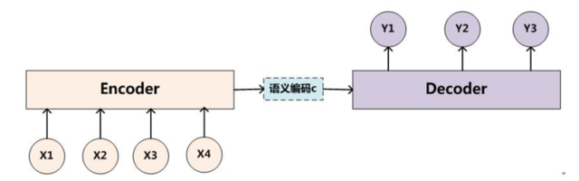

### 3.Sequence to Sequence模型

#### 模型：
训练  
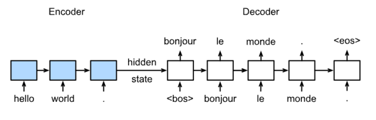
预测

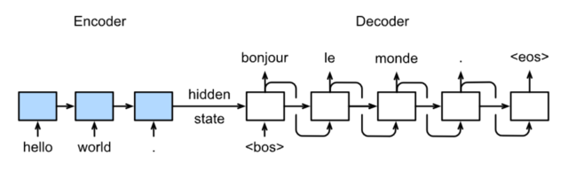

#### 具体结构

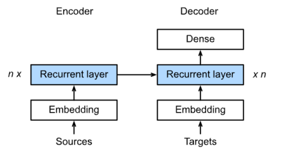

### 4.Beam Search

简单greedy search（贪心搜索）：

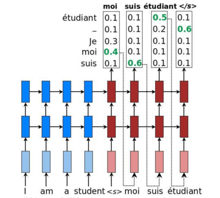

维特比算法：选择整体分数最高的句子（搜索空间太大）
集束搜索：

## 二、注意力机制与Seq2seq模型

### Seq2Seq模型

Seq2Seq模型的结构是基于编码器-解码器，它可以解决输入和输出序列不等长的问题，例如机器翻译问题。编码器和解码器本质上是两个RNN，其中编码器对输入序列进行分析编码成一个上下文向量(Context Vector)，解码器利用这个编码器生成的向量根据具体任务来进行解码，得到一个新的序列。

#### 编码器

如下图所示为一个编码器的结构，就是将输入序列$x_1$至$x_4$依次输入到编码器中得到$h_1$至$h_4$的隐含状态，而最终的上下文向量$c_t$可以使编码器最后一个时间步的隐藏状态，也可以是编码器每个时间步得到的隐藏状态进行一个函数映射（就是使用某个度量函数去表示原始序列的信息），这个上下文向量后面会在解码器生成序列中。
$$
c = h_4, \\
c = q(h_4), \\
c = q(h_1, h_2, h_3, h_4)
$$
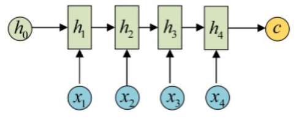

​													图1

#### 解码器

下图是两种比较常见的Seq2Seq模型的结构，两个图的左半部分都是上面所说的编码器部分，而右半部分就是解码器部分了。如图所示，其直接将编码器的输出作为解码器的初始隐藏状态，然后直接进行解码。下面第一个图是直接将编码器得到的上下文向量输入到解码器的每个时间步中，并且每个时间步的上下文向量是相同的，换句话说就是解码器每个时间步都使用了相同的上下文向量。这两种情况可能带来的问题是，当编码的句子太长的时候，由于上下文向量能够存储信息的容量是有限的，所以可能会导致信息的丢失。此外，解码器每个时间步的上下文向量都是一个相同的对输入序列的表征，对于上面两种问题，基于注意力机制的Seq2Seq模型给出了很好的解决办法。

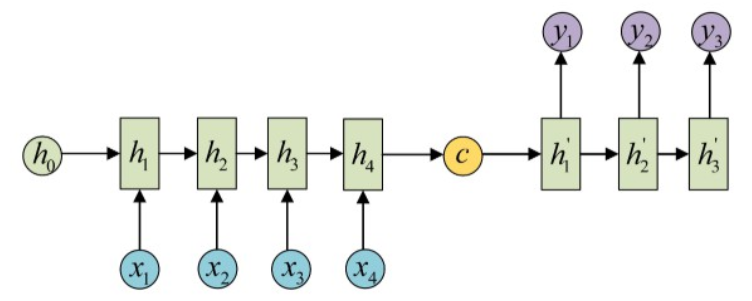

​													图2

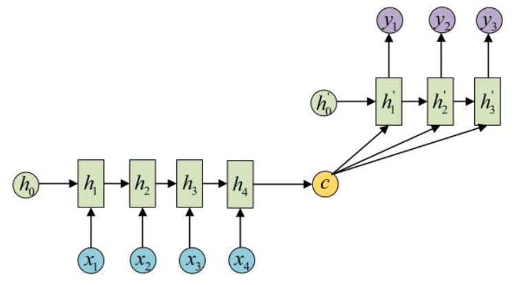

​													图3

### 基于Attention机制的Seq2Seq

基于Attention的Seq2Seq模型本质上就是在上述的图三中的解码器部分进行了改进，在解码器的每个时间步上使用不同的上下文向量$c$，如下图所示的$c_1,c_2,c_3$，但是对于解码器的初始化一般还是会使用编码器最后时间步的隐藏状态，即图中的$h'_0 = c$（此处的$c$表示的是编码器最后时间步的隐藏状态），如何得到解码器不同时间步的上下文向量就是Attention要做的事情了。

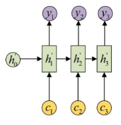

​																图4

Attention机制生成的上下文向量可以自动的去选取与当前时间步输出最有用的信息，用有限的上下文向量的容量去表示当前时间步对输入信息最关注的那部分信息，**最简单的做法就是对编码器输出的所有时间步的隐藏状态进行一个加权平均，不同的权值所对应的隐含状态就是对不同时间步的输入信息的关注程度**，如下图就很清楚的说明了具体是如何操作的。

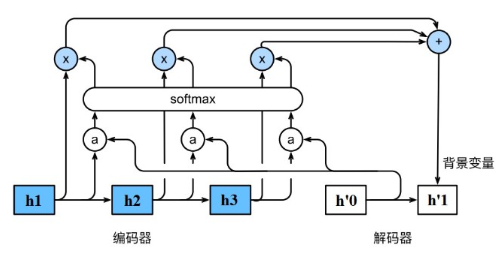

图中`a`表示的是编码器不同时间步对应的权值，而其权值又取决于编码器该时间步的隐藏状态以及解码器上一个时间步的隐藏状态。

设解码器当前隐藏状态为$s_{t'}$，则无注意力的解码器当前的隐藏状态表示为：
$$
s_{t'} = g(y_{t'-1}, c, s_{t'-1})
$$
基于注意力的解码器当前的隐藏状态表示为：
$$
s_{t'} = g(y_{t'-1}, c_{t'}, s_{t'-1})
$$
其中：

- $y_{t'-1}$：解码器上一时间步的输出
- $c$：编码器最后时间步（或者之前所有时间步隐藏状态的某种映射）的隐藏状态
- $c_{t'}$：解码器在$t'$时间步通过注意力机制获得的上下文向量
- $s_{t'-1}$：解码器的$t'-1$时间步的隐藏状态

图4和下图图5是上下文变量$c_t'$的生成过程，最后就剩下如何计算$a_{ij}$的值了。这里的`a`其实是注意力打分函数的输出，跟三部分有关，分别是查询项$q(query)$：解码器上一时间步的隐藏状态$s_{t'-1}$，键项$k(key)$和值项$v(value)$都是编码器的隐藏状态$(h_1,h_2,h_3)$。常见的注意力打分函数有：

- 加性模型：$S(x_i,q) = v^Ttanh(Wx_i + Uq)$
- 点积模型：$S(x_i,q) = x_i^Tq$
- 缩放点积模型：$S(x_i,q) = \frac{x_i^Tq}{\sqrt{d}}$
- 双线性模型：$S(x_i,q) = x_i^TWq$

点积模型可视化如下：

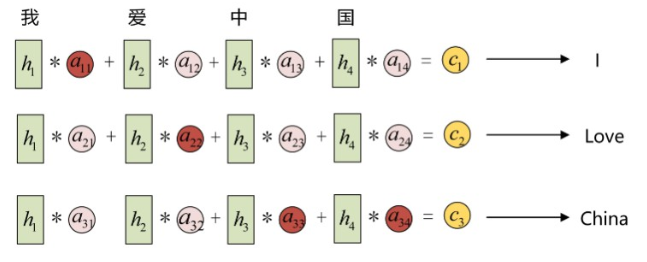

最后，基于注意力的`Seq2Seq`模型可以用下图表示：

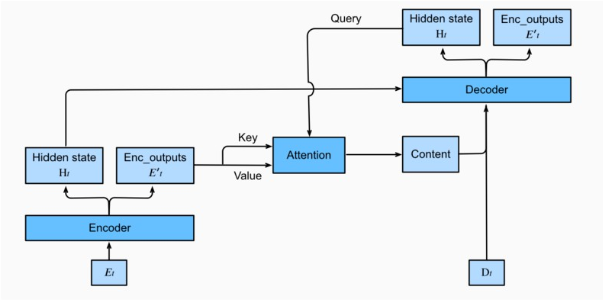

## 三、Transformer

主流的神经网络架构如卷积神经网络（CNNs）和循环神经网络（RNNs）存在以下问题：

- CNNs 易于并行化，却不适合捕捉变长序列内的依赖关系。
- RNNs 适合捕捉长距离变长序列的依赖，但是却难以实现并行化处理序列。

为了整合CNN和RNN的优势，[[Vaswani et al., 2017\]](https://d2l.ai/chapter_references/zreferences.html#vaswani-shazeer-parmar-ea-2017) 创新性地使用注意力机制设计了Transformer模型。该模型利用attention机制实现了并行化捕捉序列依赖，并且同时处理序列的每个位置的tokens，上述优势使得Transformer模型在性能优异的同时大大减少了训练时间。

上图展示了Transformer模型的架构，seq2seq模型相似，Transformer同样基于编码器-解码器架构，其区别主要在于以下三点：

1. **Transformer blocks**：将seq2seq模型重的循环网络替换为了Transformer Blocks，该模块包含一个多头注意力层(Multi-head Attention Layers)以及两个`position-wise feed-forward networks（FFN）`。对于解码器来说，另一个多头注意力层被用于接受编码器的隐藏状态。
2. **Add and norm**：多头注意力层和前馈网络的输出被送到两个“add and norm”层进行处理，该层包含残差结构以及层归一化。
3. **Position encoding**：由于自注意力层并没有区分元素的顺序，所以一个位置编码层被用于向序列元素里添加位置信息。

---

【参考资料】

- [探索NLP中的Attention注意力机制及Transformer详解](https://www.infoq.cn/article/lteUOi30R4uEyy740Ht2)

